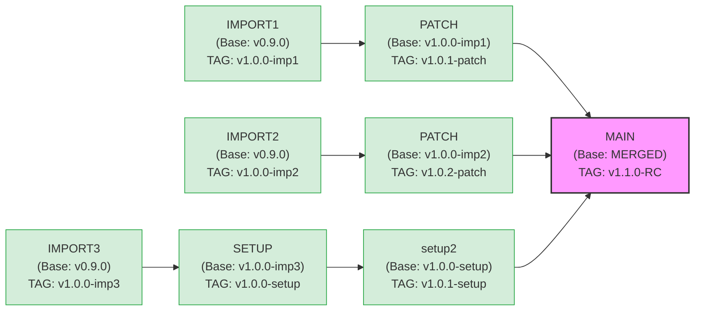

# Releases Board WIKI

## 📌 프로젝트 개요 (Project Overview)
**Releases Board**는 소프트웨어 버전 배포(Release) 일정을 관리하고, 각 릴리스의 진행 상태 및 히스토리를 한눈에 파악할 수 있도록 돕는 중앙 집중형 대시보드입니다. 여러 환경(Dev, Staging, Prod 등)과 제품에 대한 배포 상태를 투명하게 관리하여 팀 간 커뮤니케이션을 원활하게 합니다.

## 🎯 주요 기능 (Core Features)
1. **대시보드 (Dashboard)**
   - 현재 진행 중인 배포 목록 및 상태 한눈에 파악
   - 주간/월간 배포 일정표 (Calendar & Kanban View)
2. **릴리스 관리 (Release Management)**
   - 새로운 릴리스(배포 티켓) 생성, 수정, 삭제
   - 버전(Version), 배포 목록, 담당자, 환경, 배포일 설정 및 관리
   - 상태 관리 (대기 중, 테스트 중, 진행 중, 완료, 롤백 등)
3. **히스토리 및 추적 (History & Tracking)**
   - 과거 배포 이력 및 성공/실패 여부 기록
   - 변경 사항에 대한 릴리스 노트(Release Notes) 자동화 및 관리
   - 연관 이슈 트래커(Jira, GitHub Issues 등) 연동 지원
4. **알림 및 권한 (Notifications & Auth)**
   - 배포 상태 변경 시 메신저(Slack, Teams 등) 알림 연동
   - 사용자 역할(Admin, Developer, Viewer 등)에 따른 권한 제어

## 🔄 릴리스 워크플로우 (Release Workflows)

프로젝트 통합 및 파이프라인 흐름은 다음과 같습니다.
- `IMPORT1` ➞ `PATCH` ➞ `MAIN`
- `IMPORT2` ➞ `PATCH` ➞ `MAIN`
- `IMPORT3` ➞ `SETUP` ➞ `setup2` ➞ `MAIN`

**[진행 상황 특징]**
- 각 배포 단계별로 **TAG**가 부여되어 관리됩니다.
- 모든 파이프라인(`IMPORT1`, `IMPORT2`, `IMPORT3` 등)은 **동시에 (병렬로) 진행** 중입니다.

### 📊 브랜치별 TAG 적용 현황 (DAG 표현)

*참고: 위 TAG 명칭(v1.0.0 등)은 예시입니다. 실제 프로젝트의 태그 버전으로 관리됩니다.*

## 🛠 기술 스택 (Tech Stack - 예정)
- **Frontend**: (추후결정 - React / Vue / Next.js 등)
- **Backend**: (추후결정 - Spring Boot / Node.js / Python 등)
- **Database**: (추후결정 - PostgreSQL / MySQL / MongoDB 등)
- **Infra/Deploy**: (추후결정 - Docker, Kubernetes, AWS 등)

## 📂 프로젝트 구조 (Project Structure)
*프로젝트 초기 설정이 완료된 후 구체적인 코드 베이스 구조에 대해 업데이트될 예정입니다.*

## 🚀 로컬 환경 실행 가이드 (Getting Started)
*환경 설정 및 빌드/실행 방법이 결정되면 여기에 작성됩니다.*

## 📝 협업 가이드 (Contribution Guide)
- **브랜치 전략 (Branch Strategy):** 예) Git Flow 또는 GitHub Flow
- **커밋 컨벤션 (Commit Convention):** 예) `feat:`, `fix:`, `docs:` 등의 접두사 활용
- **코드 리뷰 (Code Review):** PR(Pull Request) 시 최소 1인 이상의 승인 필수
