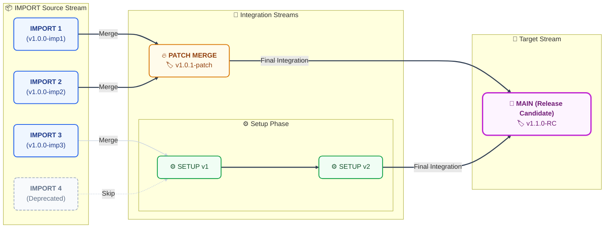

# Releases Board WIKI

## 📌 프로젝트 개요 (Project Overview)
**Releases Board**는 소프트웨어 버전 배포(Release) 일정을 관리하고, 각 릴리스의 진행 상태 및 히스토리를 한눈에 파악할 수 있도록 돕는 중앙 집중형 대시보드입니다. 여러 환경(Dev, Staging, Prod 등)과 제품에 대한 배포 상태를 투명하게 관리하여 팀 간 커뮤니케이션을 원활하게 합니다.

## 🎯 주요 기능 (Core Features)
1. **대시보드 (Dashboard)**
   - 현재 진행 중인 배포 목록 및 상태 한눈에 파악
   - 주간/월간 배포 일정표 (Calendar & Kanban View)
2. **릴리스 관리 (Release Management)**
   - 새로운 릴리스(배포 티켓) 생성, 수정, 삭제
   - 버전(Version), 배포 목록, 담당자, 환경, 배포일 설정 및 관리
   - 상태 관리 (대기 중, 테스트 중, 진행 중, 완료, 롤백 등)
3. **히스토리 및 추적 (History & Tracking)**
   - 과거 배포 이력 및 성공/실패 여부 기록
   - 변경 사항에 대한 릴리스 노트(Release Notes) 자동화 및 관리
   - 연관 이슈 트래커(Jira, GitHub Issues 등) 연동 지원
4. **알림 및 권한 (Notifications & Auth)**
   - 배포 상태 변경 시 메신저(Slack, Teams 등) 알림 연동
   - 사용자 역할(Admin, Developer, Viewer 등)에 따른 권한 제어

## 🔄 릴리스 워크플로우 (Release Workflows)

Releases Board의 파이프라인은 크게 **세 가지 스트림(Stream)**으로 나뉘어 관리되며, 각 배포/통합 단계마다 고유한 **TAG**가 부여됩니다. 아래의 DAG 다이어그램 레이아웃에 맞춰 전체 흐름을 이해할 수 있습니다.

### 1. IMPORT Source Stream (기초 작업)
각기 다른 요구사항이나 환경을 위한 기초 분기 브랜치들입니다.
- `IMPORT1`, `IMPORT2`, `IMPORT3` 브랜치는 각각 독립적인 변경 사항을 달고 **병렬로 진행 및 관리**됩니다.
- 🚫 **참고**: `IMPORT4` 브랜치 흐름은 통합 시스템 변경으로 인해 현재는 **사용이 중단(Deprecated)** 되었습니다.

### 2. Integration Streams (통합 과정)
각 Source 브랜치들의 변경 사항을 하나로 합치거나 묶는 중간 과정입니다.
- **PATCH 통폐합**: `IMPORT1`과 `IMPORT2`의 주요 코드는 하나의 **`PATCH (Merged)`** 브랜치로 함께 통합 관리됩니다.
- **SETUP 통폐합**: `IMPORT3`의 변경 사항과 각종 설정은 **`SETUP (Merged)`**을 거쳐 **`setup (Merged)`** 브랜치로 단계적인 통합을 거치게 됩니다.

### 3. Target Stream (최종 반영)
- Integration Stream을 거친 `PATCH`와 `setup` 브랜치의 최종 산출물들은 모두 **`MAIN` 브랜치**로 모여 최종 릴리스(Release Candidate) 자산으로 취합됩니다.
- **새로운 릴리스 흐름**: 이렇게 확보된 `MAIN` 브랜치의 태그를 기준점(Base) 삼아 향후 기타 추가 흐름들이 파생되거나 계속 통합될 예정입니다.

---

### 📊 브랜치별 TAG 적용 현황 (DAG 표현)



*참고: 위 TAG 명칭(v1.0.0 등)은 예시입니다. 실제 프로젝트의 태그 버전으로 관리됩니다.*

```
