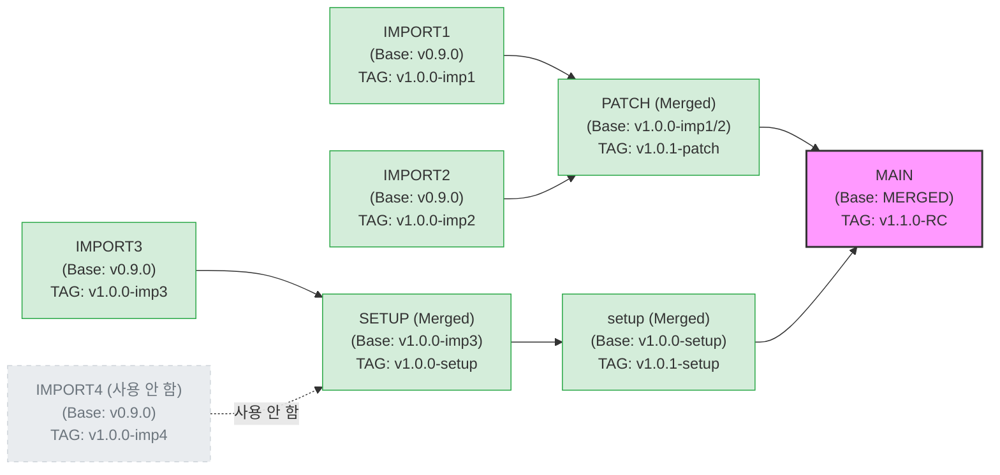

# Releases Board WIKI

## 📌 프로젝트 개요 (Project Overview)
**Releases Board**는 소프트웨어 버전 배포(Release) 일정을 관리하고, 각 릴리스의 진행 상태 및 히스토리를 한눈에 파악할 수 있도록 돕는 중앙 집중형 대시보드입니다. 여러 환경(Dev, Staging, Prod 등)과 제품에 대한 배포 상태를 투명하게 관리하여 팀 간 커뮤니케이션을 원활하게 합니다.

## 🎯 주요 기능 (Core Features)
1. **대시보드 (Dashboard)**
   - 현재 진행 중인 배포 목록 및 상태 한눈에 파악
   - 주간/월간 배포 일정표 (Calendar & Kanban View)
2. **릴리스 관리 (Release Management)**
   - 새로운 릴리스(배포 티켓) 생성, 수정, 삭제
   - 버전(Version), 배포 목록, 담당자, 환경, 배포일 설정 및 관리
   - 상태 관리 (대기 중, 테스트 중, 진행 중, 완료, 롤백 등)
3. **히스토리 및 추적 (History & Tracking)**
   - 과거 배포 이력 및 성공/실패 여부 기록
   - 변경 사항에 대한 릴리스 노트(Release Notes) 자동화 및 관리
   - 연관 이슈 트래커(Jira, GitHub Issues 등) 연동 지원
4. **알림 및 권한 (Notifications & Auth)**
   - 배포 상태 변경 시 메신저(Slack, Teams 등) 알림 연동
   - 사용자 역할(Admin, Developer, Viewer 등)에 따른 권한 제어

## 🔄 릴리스 워크플로우 (Release Workflows)

프로젝트 통합 및 파이프라인 흐름은 다음과 같습니다.
- `IMPORT1` & `IMPORT2` ➞ **`PATCH` (통합)** ➞ `MAIN`
- `IMPORT3` ~~& `IMPORT4`~~ ➞ `SETUP` ➞ **`setup` (통합)** ➞ `MAIN`

**[진행 상황 특징]**
- 각 배포 단계별로 **TAG**가 부여되어 관리됩니다.
- 🚫 **`IMPORT4` ➞ `SETUP` 경로 중단**: `IMPORT4`에서 `SETUP`으로 이어지던 흐름은 통합이 완료/변경되어 더 이상 사용되지 않습니다. **(완료 / 회색 표시)**
- 🔄 **그 외 파이프라인**(`IMPORT1`, `IMPORT2`, `IMPORT3` 경로)은 현재 **동시에 (병렬로) 계속 진행 중**입니다. 
- 🔗 **PATCH / SETUP 브랜치 통합**: `IMPORT1`과 `IMPORT2`의 수정 사항은 `PATCH` 브랜치로 함께 관리되며, `IMPORT3`의 흐름은 `SETUP` 및 `setup` 브랜치로 통합 관리됩니다.
- **새로운 릴리스 흐름**: `MAIN` 브랜치를 바탕으로 향후 기타 흐름들이 계속 통합될 예정입니다.

### 📊 브랜치별 TAG 적용 현황 (DAG 표현)



*참고: 위 TAG 명칭(v1.0.0 등)은 예시입니다. 실제 프로젝트의 태그 버전으로 관리됩니다.*

```
